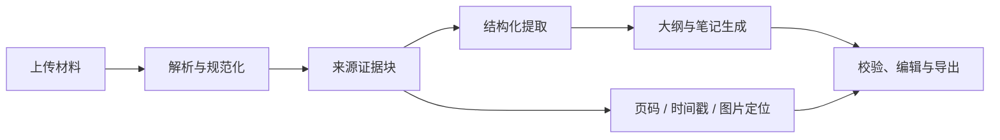

# Nota

**把材料变成可核对、可修订、可导出的知识笔记。**

Nota 是一个本地运行的笔记工作台。它接收 PDF、Word、PPT、图片、文本和录音，将材料拆成带来源定位的证据块，再生成课程笔记、论文阅读笔记或会议纪要。笔记可以继续编辑、局部 AI 修订、恢复历史版本，并导出为 HTML、PDF、Markdown 或逐字稿。

> Nota 只监听 `127.0.0.1`，不会作为公网服务启动。模型处理与录音转写仍会把相应材料发送到你在本机配置的第三方模型服务。

## 能做什么

- **混合材料输入**：支持 PDF、DOCX、PPTX、常见图片、UTF-8 文本和录音；一次任务可组合多份材料。
- **按材料类型生成**：可选择个人笔记、课堂 PPT、论文、教材、习题、会议或自动识别，调整提取和写作路线。
- **来源可追溯**：正文内容绑定原始片段、页码或音频时间；图片只在与对应内容有关时插入。
- **结构化知识笔记**：提取概念、主张、公式、实验和视觉证据，生成分层正文、知识卡与复习题。
- **可编辑与可恢复**：支持手动编辑、章节修订、逐字稿校对、版本 diff 与恢复。
- **录音处理**：使用 Paraformer 转写；先保存句级时间戳，再合并为可编辑的语义段。
- **本地导出**：支持 HTML、PDF、Markdown、含图片的 ZIP，以及逐字稿。来源标注可在导出时选择是否保留。
- **模型路由**：可在界面中给 Cards、Outline、Writer、Vision 和 ASR 分别配置模型；只配置默认模型时，所有非 ASR 步骤自动回退到它。

## 工作方式



生成流程以来源证据块为约束：正文、公式、图片和复习题都需要能够追溯到材料。模型返回的可选内容如果不符合结构或引用规则，系统会尝试修复或跳过该模块，避免单个非核心模块阻断整份笔记。

## 快速开始

要求：Python **3.11+**、网络连接（首次安装依赖时需要）。浏览器访问地址为 <http://127.0.0.1:7860>。

### Windows

双击 `Nota.cmd`。首次运行会调用 `setup.cmd`：它会复用已有 Python；若未安装 Python，则通过 Windows Package Manager（`winget`）安装 Python 3.12，创建虚拟环境并安装依赖。随后浏览器会自动打开。

如果要观察后端日志，请运行 `start.cmd`。

### macOS / Linux

首次在终端执行：

```bash
chmod +x setup.sh Nota.sh
./setup.sh
./Nota.sh
```

`setup.sh` 会检测 Python 3.11+。缺失时，macOS 会调用 Homebrew；Linux 会调用 apt、dnf 或 pacman。Linux 安装系统软件时需要输入 `sudo` 密码。若 macOS 没有 Homebrew，脚本会给出安装提示。

### 手动启动

适合开发和排错：

```bash
python -m venv .venv
# Windows: .\.venv\Scripts\python.exe -m pip install -r requirements.txt
# macOS / Linux:
.venv/bin/python -m pip install -r requirements.txt
.venv/bin/python object/server.py
```

Windows 上将最后两行替换为：

```powershell
.\.venv\Scripts\python.exe -m pip install -r requirements.txt
.\.venv\Scripts\python.exe object\server.py
```

## 配置模型

启动后，在页面右上角打开 **模型设置**。密钥由浏览器提交给本机后端；接口不会把密钥回传给前端，也不会在页面上显示已保存的密钥。

通常只需填写一组**默认模型**：模型名称、兼容 OpenAI Chat Completions 的 API URL 和 API Key。Cards、Writer、Vision、Outline 会默认使用它。需要单独配置时，可展开对应角色覆盖默认值。

| 角色 | 用途 | 建议 |
| --- | --- | --- |
| Cards | 从材料提取知识卡和证据 | Claude 或 GPT |
| Outline | 组织结构、审校和规划 | DeepSeek 或默认模型 |
| Writer | 写出笔记正文 | Claude 或 GPT |
| Vision | 分析页面、表格、图示与裁剪候选 | Claude 或 GPT 的视觉模型 |
| ASR | 录音转写 | 阿里云百炼 Paraformer |

ASR 是可选项；上传音频而未配置时，Nota 会在生成前提示配置。当前 ASR 使用 Paraformer 的文件上传与异步转写接口，因此应填写 DashScope API Key 与对应接口地址。

也可以在 `object/.env` 中预置默认值：

```ini
OPENAI_API_KEY=
OPENAI_BASE_URL=https://api.openai.com/v1
GPT_MODEL=

DEEPSEEK_API_KEY=
DEEPSEEK_BASE_URL=https://api.deepseek.com
OUTLINE_MODEL=deepseek-chat

DASHSCOPE_API_KEY=
DASHSCOPE_BASE_URL=https://dashscope.aliyuncs.com/api/v1
PARAFORMER_MODEL=paraformer-v2
```

`setup.cmd` 和 `setup.sh` 只会在不存在时从 `object/.env.example` 创建该文件，不会覆盖已有配置。

## 数据、密钥与隐私

- 运行数据、上传文件、导出结果和本机模型路由配置都保存在 `object/data/`，该目录已被 Git 忽略。
- `object/.env` 同样已被 Git 忽略；请不要提交真实 API Key、录音或私有学习材料。
- 浏览器不会读取或显示保存后的 API Key。模型路由设置仅保存在本机后端的数据目录中。
- 发送给模型服务商的内容取决于任务：文本与结构化片段会发送给文本模型；需要视觉理解时会发送对应页面或图像；录音会发送给所配置的 ASR 服务。

## 个人服务器部署

这一部署方式面向**单个受信任用户**：仍使用 SQLite 和本地文件目录，不包含账户注册或多人数据隔离。部署前请确保服务器开放 TCP `80`、`443`，并将域名的 A/AAAA 记录指向服务器。

服务器建议从 4 核 CPU、8 GB 内存、80 GB SSD 起步；模型推理与转写使用外部 API，不需要 GPU。

Docker 镜像内置 XeLaTeX、Pandoc 与 Noto 中文字体，因此服务器也可导出包含数学公式的 PDF。首次构建会额外下载约 1--2 GB 的排版依赖，完成后会被 Docker 缓存。

```bash
git clone https://github.com/BaiYe-color/Nota.git
cd Nota
cp deploy/.env.example deploy/.env
# 编辑 deploy/.env：填写域名、模型密钥与强密码的哈希
mkdir -p runtime/data runtime/backups runtime/caddy/data runtime/caddy/config
# 让容器内的非 root Nota 账户可以写入持久化数据目录
sudo chown -R 10001:10001 runtime/data runtime/backups
docker compose run --rm caddy caddy hash-password --plaintext '换成一条长密码'
# 将输出复制为 deploy/.env 中的 NOTA_BASIC_AUTH_HASH
docker compose up -d --build
docker compose ps
```

`Caddyfile` 会自动申请和续期 HTTPS 证书，并以 Basic Auth 保护整个站点。不要移除这层访问保护，也不要把 `deploy/.env`、`runtime/` 或备份文件提交到 Git。

查看服务日志：

```bash
docker compose logs -f app
docker compose logs -f caddy
```

### 备份与清理

运行以下命令会在 `runtime/backups/` 创建包含 SQLite 快照、上传原件、导出文件和模型路由配置的压缩备份：

```bash
chmod +x deploy/backup.sh deploy/cleanup.sh
./deploy/backup.sh
```

建议每天运行一次备份，并将备份复制到服务器之外的加密存储。备份包含模型路由配置和材料原件，应按敏感数据保管。

`maintenance` 容器会在启动后立即清理一次，之后默认每 24 小时执行。它只删除旧缓存和旧导出文件，**不会删除上传原件、笔记或数据库**；此外会把缓存与导出文件的合计容量控制在默认 4 GB 内，优先清理最旧的缓存，再清理最旧导出文件。可在 `deploy/.env` 调整这些值。

仍可随时手动清理：

```bash
# 先预览
./deploy/cleanup.sh --dry-run
# 执行清理；默认缓存保留 14 天、导出保留 30 天
./deploy/cleanup.sh
```

备份仍建议加入服务器的 cron，例如每天凌晨 03:10 运行：

```cron
10 3 * * * cd /srv/Nota && ./deploy/backup.sh >> runtime/backup.log 2>&1
```

## 项目结构

```text
object/
  server.py          FastAPI 服务与本地 API
  materials.py       上传、材料识别与解析入口
  extraction.py      来源证据块、图片与公式提取
  notes_pipeline.py  笔记生成与校验流程
  generation.py      模型调用与结构化内容生成
  asr.py             Paraformer 转写与语义段合并
  router.py          本机模型路由配置
  export.py          HTML / PDF / Markdown 导出
  static/            单页前端与本地 KaTeX 资源
tests/               自动化测试
evals/               离线质量评测案例与基线工具
setup.cmd/.sh        首次安装脚本
Nota.cmd/.sh         快速启动脚本
```

## 测试与评测

安装开发依赖后运行：

```bash
# Windows: .\.venv\Scripts\python.exe -m pip install -r requirements-dev.txt
# macOS / Linux:
.venv/bin/python -m pip install -r requirements-dev.txt
.venv/bin/python -m pytest
```

Windows：

```powershell
.\.venv\Scripts\python.exe -m pip install -r requirements-dev.txt
.\.venv\Scripts\python.exe -m pytest
```

离线评测案例和使用方法位于 [evals/README.md](evals/README.md)。评测不包含密钥和私人材料。

## 常见问题

**双击 Nota 后没有打开页面**

先运行 `start.cmd`（macOS/Linux 则运行 `.venv/bin/python object/server.py`）查看实际错误。常见原因是虚拟环境失效、端口 7860 被其他程序占用，或首次依赖安装尚未完成。

**上传录音后提示未配置 ASR**

在“模型设置”填写 DashScope 的 API Key、API URL 和 Paraformer 模型名后重新提交。

**模型调用失败或生成不稳定**

检查模型名称、API URL、余额和网关是否支持 OpenAI Chat Completions。复杂论文、PPT 图表和手写材料建议为 Vision 和 Writer 配置能力更强的模型；Outline 可单独使用成本较低的模型。

**导出 PDF 较慢**

PDF 会等待 HTML 渲染、公式排版和本地图片处理完成。可先导出 HTML 预览；不需要来源标注时，在导出选项中关闭它以减少版面内容。
