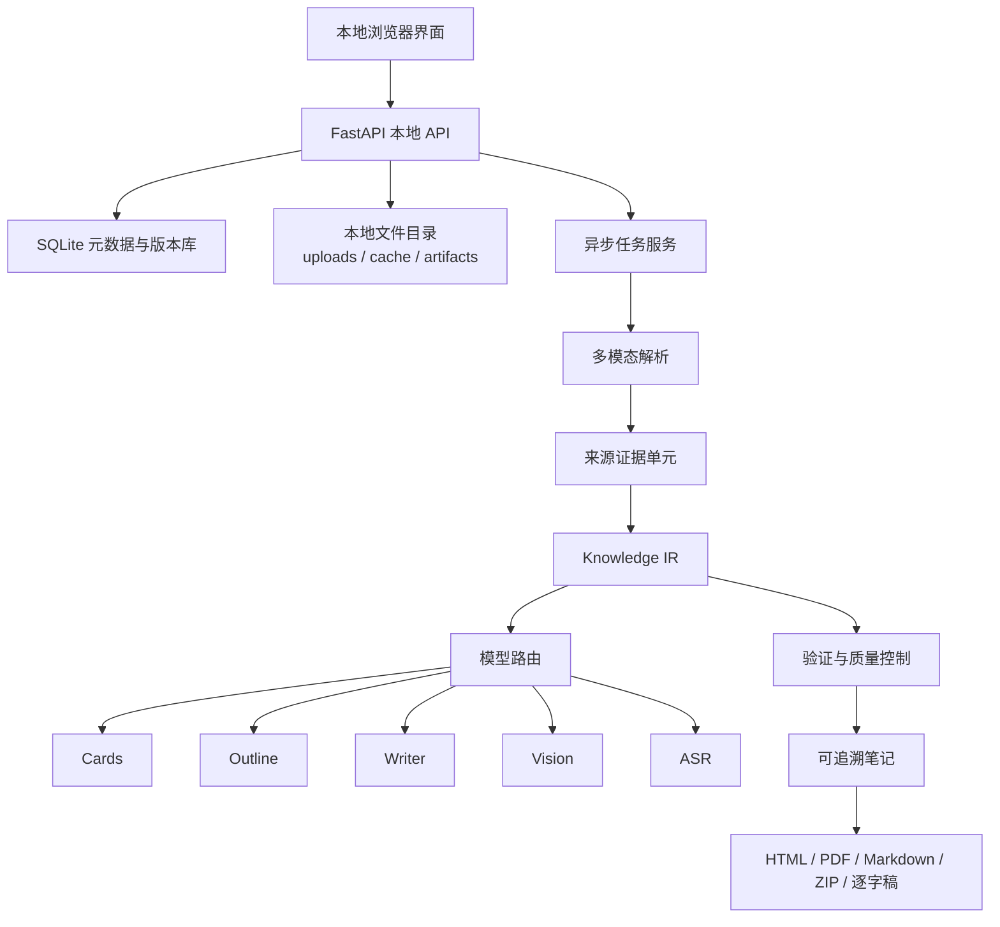

# Nota 技术说明书（本地化部署版）

## 1. 项目定位

Nota 是一个面向学习材料的**本地化可溯源笔记生成系统**。系统在用户本机运行，把多模态材料解析为可定位的证据单元，构建结构化知识中间表示，再完成生成、校验、编辑、恢复与导出。

本文只说明本地运行的系统设计，**不包含服务器部署、容器编排、反向代理或公网访问技术**。

## 2. 设计目标

1. **可追溯**：正文可以回到原始材料的页码、文本、图片或音频时间位置。
2. **多模态统一**：不同输入格式归一为同一证据模型。
3. **结构化生成**：用知识卡、主张、概念、公式和视觉证据约束生成，避免无约束续写。
4. **可恢复**：缓存可复用阶段并保存检查点，错误后从接近故障的位置继续。
5. **用户可控**：支持模型路由、局部编辑、版本恢复和多格式导出。
6. **本地数据优先**：运行数据与路由配置由本地后端管理，网页端不读取已保存密钥。

## 3. 本地总体架构



前端通过本地 API 上传材料、发起任务、接收进度事件、读取笔记和导出产物。后台任务、SQLite、原始材料、缓存和导出文件都位于本机数据目录。

## 4. 多模态解析与证据单元

系统支持 PDF、DOCX、PPTX、文本、图片和音频。不同解析器分别提取正文、标题、表格、页面、图像和录音转写；音频先获得句级时间戳，再依据停顿、说话人切换和语义转折合并为语义段。

所有内容最终归一为 `SourceBlock`。关键字段包括：

- `document_id`、`document_name`：来源身份；
- `page` 或 `start_ms/end_ms`：页码或时间定位；
- `text`、`kind`：可处理文本和内容类别；
- `asset`、`evidence_asset`、`bbox`：图片、页面区域等视觉定位；
- `method`、`uncertain`：解析方式与不确定性；
- `material_type`、`material_role`：材料类型与任务角色。

`SourceBlock` 是来源追溯、证据检索、正文生成和界面展示之间的共同数据契约。

## 5. RAG 与证据检索

Nota 使用的是**证据约束的 RAG**。它先在本地材料中建立可定位的来源块，再围绕章节选择关联知识与证据进行生成和验证。

当前实现不依赖向量数据库。其检索链路以来源块、知识卡、主张、概念关系、公式、实验、视觉对象和章节映射构成，强调可解释的来源关系，而不是只依赖相似度召回。


核心约束包括：知识卡必须引用既有来源标识；主张、公式、实验与视觉对象保留来源关联；章节由知识卡组织；生成后检查来源使用、覆盖情况、冲突和待核对项。RAG 的作用是降低无依据生成，并让用户可回查依据，而不是承诺内容绝对正确。

## 6. Prompt 设计与模型路由

### 角色分工

| 角色 | 主要职责 | 主要输出 |
| --- | --- | --- |
| Cards | 从来源块提取可复用知识 | 知识卡、来源引用、公式与例子线索 |
| Outline | 组织结构、规划章节、审校 | 章节结构与覆盖关系 |
| Writer | 按章节关联证据撰写 | Markdown 正文与复习问题 |
| Vision | 理解表格、图示、图表和页面 | 视觉描述与结构化视觉证据 |
| ASR | 转写录音 | 句级转写、时间戳、说话人信息 |

### Prompt 原则

1. 输入被限定为指定来源块、知识卡和章节任务，避免无边界上下文；
2. Cards、Outline 等阶段要求结构化 JSON 返回，并进行模式校验；
3. 知识卡、主张、公式和视觉证据必须引用存在的来源 ID；
4. Outline、Writer、Vision 的职责分离，降低单模型全流程失控；
5. 非核心模块失败时可记录问题并跳过，减少单点失败对整份笔记的影响。

### 路由策略

- 默认模型承担 Cards、Writer、Vision 等质量敏感步骤，推荐 Claude 或 GPT；
- Outline 可单独路由到 DeepSeek 等低成本模型；
- ASR 使用独立路由；
- 每个任务保存模型路由快照，防止运行过程中配置变化影响任务；
- 读取模型配置时只返回是否已配置，不回传真实 API Key。

## 7. 知识中间表示与生成流程

`KnowledgeIR` 将材料解析与最终文案分离，包含：

- `claims`：主张、条件、上下文、置信度和来源；
- `concepts` 与 `concept_edges`：概念及其前置、组成、对比、关联关系；
- `formulas`：公式、变量说明和来源；
- `experiments`：数据集、设置、指标、结果和来源；
- `visuals`：图、表、图示等视觉证据；
- `conflicts`：数值或表述不一致的待核对冲突。

生成流水线：

1. 上传材料并建立内容摘要；
2. 解析材料，输出 `SourceBlock`；
3. 抽取知识卡和 Knowledge IR；
4. 建立概念关系并规划章节；
5. 准备章节关联知识和来源；
6. Writer 生成正文与复习问题；
7. 校验 Markdown、公式、来源、覆盖情况和质量提示；
8. 保存笔记、版本和质量报告。

## 8. 验证、缓存与恢复

### 验证

Pydantic 模型约束来源标识、知识卡、主张、公式、章节和视觉证据等关键结构。生成后执行 Markdown 清理、公式守卫、未知来源检查、章节质量检查、覆盖统计与冲突提示。

### 内容寻址缓存

解析和模型调用等阶段使用内容寻址缓存。缓存键由流水线版本、阶段名称和输入摘要构成：输入相同则复用结果；材料、参数或流水线版本变化则产生新缓存。任务指标会记录缓存命中与模型调用情况。

### 检查点恢复

任务在“解析完成”和“知识提取完成”等阶段保存检查点。失败或中断后：

- 解析检查点可用时跳过重复解析；
- 知识检查点可用时跳过知识卡和概念关系构建；
- 只重新执行故障附近的后续生成和校验。

降级重试会改变输出策略，因此按新策略重新生成，而不复用不匹配的检查点。

## 9. 本地持久化、版本和任务

SQLite 保存文件元数据、任务状态、事件流、笔记索引、不可变修订版本和偏好。原文件、缓存和导出产物保存在本地目录。

- 编辑、局部修订与恢复都会创建新版本；
- 使用乐观并发控制，避免旧页面覆盖新版本；
- 最近笔记保留最近更新的 10 条，可重新打开、导出或删除；
- 删除笔记删除笔记与版本历史，不删除原始材料；
- 任务进度通过 Server-Sent Events 推送；
- 服务重启后，未完成任务被标记为中断，便于用户重试。

## 10. 安全边界与局限

- 运行数据在本机，但调用外部模型或 ASR 时，相关材料会发送给用户配置的服务商；
- 来源追溯提高可核对性，不替代人工事实核查；
- 长文档、图像密集材料和长录音会增加处理时间，建议预拆分；
- PDF 导出依赖本机 Pandoc、XeLaTeX 与字体环境；失败时可导出 HTML 或 Markdown；
- 系统面向个人学习和单机使用，不提供多人账户、权限隔离或协同编辑。

## 11. 测试与质量保障

项目自动化测试覆盖上传、生成、编辑、修订、版本恢复、导出、任务重试、缓存、转写与材料解析等核心流程。建议修改核心流水线后运行：

```powershell
.\.venv\Scripts\python.exe -m pytest tests\test_nota.py -q
```
